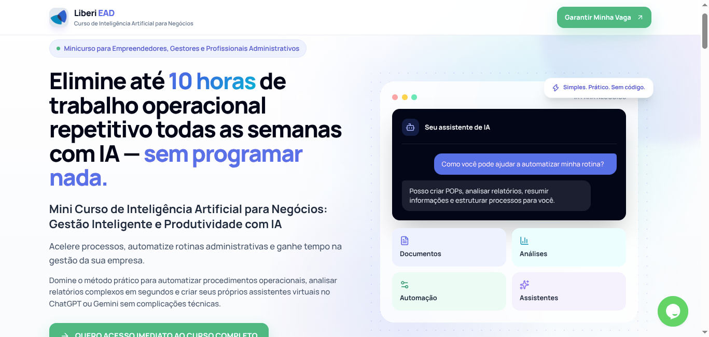

# Landing Page: Mini Curso de IA para Negócios

> **Projeto completo de produto digital:** Desenvolvimento de Landing Page de alta conversão para WordPress, arquitetura de curso LMS (LearnDash), UX/UI responsivo (Mobile-First) e estratégia integrada de Copywriting & SEO On-Page.

---

## Visão Geral do Projeto

Este repositório contém a documentação, os conceitos de design e a implementação técnica da *Landing Page* e da arquitetura pedagógica do **Curso de Inteligência Artificial para Negócios (Liberi EAD)**.

O objetivo central do produto foi criar uma solução *no-code* focada em gestores, empreendedores e profissionais administrativos que buscam otimizar até 10 horas semanais de processos repetitivos utilizando ferramentas de IA Generativa (ChatGPT e Gemini).

---

## UX/UI (Mobile-First) e Design

A interface foi projetada do zero focando em usabilidade, velocidade de carregamento e taxa de conversão (CRO).

| Wireframe Desktop                                                  | Esboço Mobile (Single-Column)                                        |
|:------------------------------------------------------------------:|:--------------------------------------------------------------------:|
|  |  |

* **Wireframe Desktop & Mobile:** Mapeamento de telas focado na eliminação de atritos visuais e adaptação de navegação compacta (*Fixed Header* em telas pequenas).

* **Design Responsivo:** Transição de layouts multi-colunas no desktop para estruturas verticais empilhadas (*Single-Column*) no mobile.
  
  * Desktop ≥ 1024px
  * Tablet 768–1023px
  * Mobile < 768px

* **Paleta de Cores e sua lógica psicológica:** estruturar a identidade em três conceitos:
  
  * **Índigo → Inteligência / tecnologia** `azul indigo #4F46E5`
    É a cor que dá ao curso uma identidade de IA sem parecer uma empresa de tecnologia extremamente técnica.
  
  * **Verde → Resultado / negócio** `verde esmeralda #10B981`
    Ajuda a deslocar a percepção de “curso de IA” para **“IA aplicada para gerar produtividade e resultados”**.
  
  * **Branco/cinza → simplicidade** `branco frio #F8FAFC`
    Isso é particularmente importante porque a promessa é:
    
    **Usar IA sem precisar aprender programação.** Mas sendo acessível e profissional. Ou seja, o próprio design deve comunicar que **não é necessário ser desenvolvedor**.

* **Fonte Textual**
  
  A combinação precisa preservar o aspecto sofisticado do design, mas sem perder legibilidade. Em google fonts.
  
  * **Manrope — fonte principal**
    Funciona muito bem para uma proposta de **IA + negócios + tecnologia**, porque tem aparência moderna sem ser excessivamente “tech”.
  * **Inter — fonte secundária**
    É a fonte responsável por elementos mais funcionais como badges, pequenos textos, preços.

---

## Tech Stack & Arquitetura de Código

- **Core:** PHP (WordPress Template Injection)
- **Styling & Frameworks:** Tailwind CSS (via CDN) + Custom CSS
- **Ícones & Micro-interações:** Lucide Icons
- **Plataforma EAD / LMS:** WordPress + LearnDash (Sincronização 1:1 de Módulos, Quizzes e Material Complementar)

---

## Estratégia de Copywriting, SEO & CRO

A página foi construída alinhada às diretrizes mais recentes de SEO On-Page e psicologia de consumo:

1. **Atendimento à Intenção de Busca (*Search Intent* Misto):**
   - Incorporação de blocos educativos e descrições detalhadas das lições do e-Learn para captura de tráfego informativo e comercial.
2. **Palavras-Chave de Alta Conversão:**
   - Análise de Palavras-chave no Keyword Planner do Google ADS, e no Semrush para resultados com intervalo de 12 meses e de suas tendências.
3. **Rich Snippets & PAA (People Also Ask):**
   - Estruturação de FAQs estratégicas preparadas para indexação dinâmica nos resultados de pesquisa do Google.

---

## Mapeamento Curricular e Módulos do Curso

O minicurso foi estruturado em uma imersão focada em prática:

- **Módulo 1:** O Gestor 2.0 e o Ecossistema Prático de IA
- **Módulo 2:** Automação da Rotina e Processos Administrativos (Gerador de POPs & Análise de DREs/Relatórios)
- **Módulo 3:** Criando Assistentes Fixos de Gestão (Gems / Custom GPTs) com a *Fórmula do Prompt Mestre*

---

## Competências Demonstradas neste Projeto (*Skills Matrix*)

- **Front-End Development:** PHP, HTML5, Tailwind CSS, Layouts Responsivos.

- **UX/UI Design:** Wireframing, Arquitetura de Informação, Mobile-First Design.

- **EdTech & LMS:** Integração de Conteúdo Educacional (LearnDash/WordPress).

- **SEO & Copywriting:** SEO On-Page, Search Intent Mapping, CRO (Conversion Rate Optimization).

- **WPO & Core Web Vitals:** Diagnóstico e análise de métricas de carregamento no celular FCP e LCP; e implemento de *preconnects* e otimização de requisições.

- **Consumo de API:** criação de script para requisições à API do Google PageSpeed Insights, processando o diagnóstico bruto e gerando um JSON estruturado com métricas confiáveis do Core Web Vitals.

- **Engenharia de Prompt HITL:** Uso de LLMs para auxílio na produção de código e estruturação de dados, com validação humana para auditoria técnica.

## Link de acesso:

- [Mini curso de ia para negócios](https://liberi-ead.com/curso-de-ia-para-negocios/)

---

Developed by [Esthefison / Remoto](https://remotoagencia.com.br/) 🚀
